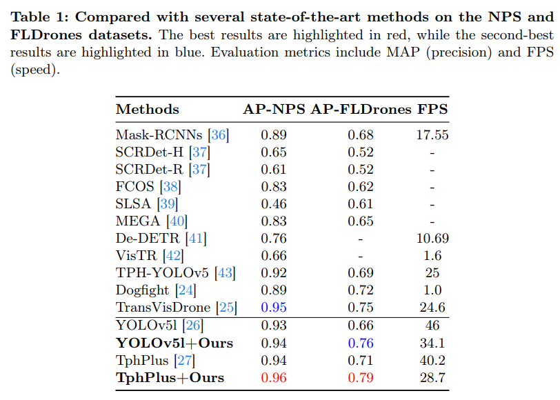
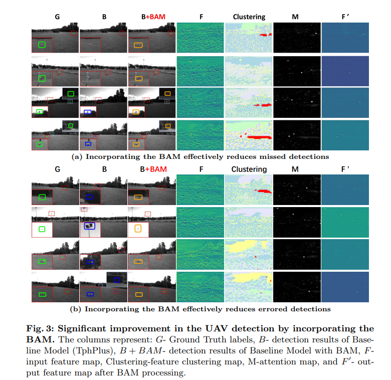

## Background-centric Attention Module(BAM)

 1. We find that background information can provide an important guidance for UAV detection, which is consistent with human-like recognition procedure while usually ignored in previous studies.
 2. We design a novel Background-centric Attention Module (BAM) to effectively model background regions of the image and discover dissimilar areas as potential targets. Besides, BAM is designed in a plug-and-play style and can be easily implemented in existing detectors.
 3. We implement BAM on two mainstream detectors and experimentally evaluate on two representative and challenging benchmarks, and the results demonstrate its effectiveness and generalization ability.


## Install
```
$ git clone https://github.com/Fafafa2/BAM
$ cd BAM
$ pip install -r requirements.txt
```
## Datasets
Download the NPS dataset from here:
[NPS Dataset Download](https://engineering.purdue.edu/~bouman/UAV_Dataset/)

Download the FLDrones dataset from here:
[FLDrones Dataset Download](https://openaccess.thecvf.com/content_cvpr_2015/papers/Rozantsev_Flying_Objects_Detection_2015_CVPR_paper.pdf)

Download the DogFight version annotation of the above dataset
[Annotation](https://github.com/mwaseema/Drone-Detection/tree/main/annotations)

## Visualization

